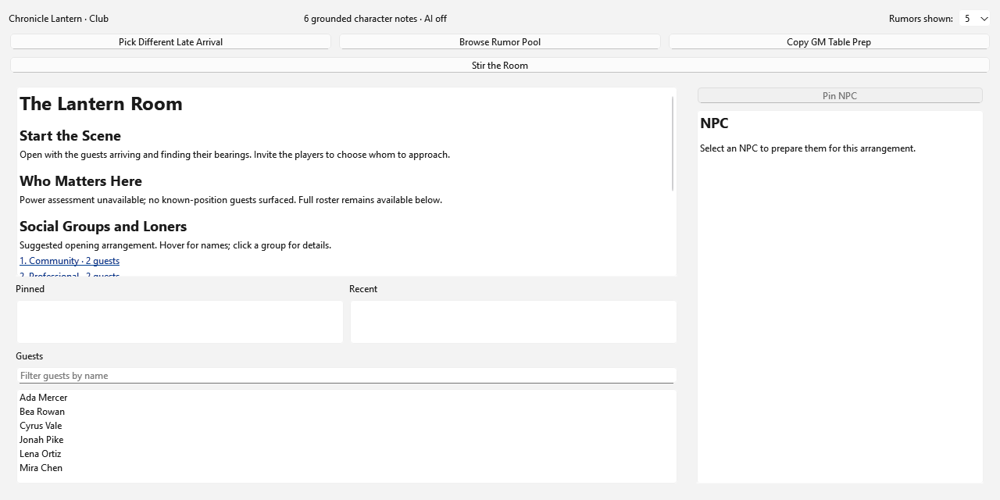
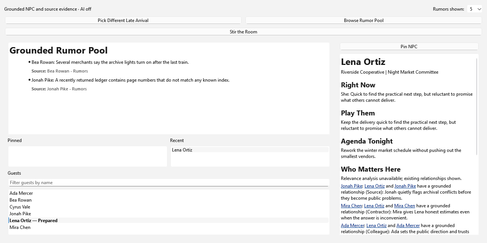

# Chronicle Lantern

[](https://github.com/Mortonas/chronicle-lantern/actions/workflows/windows-tests.yml)

I'm Alexander Morton, and I built Chronicle Lantern to turn a large Markdown campaign vault into focused preparation I can actually use at the table. It brings scene building, character discovery, relationship-aware social planning, campaign continuity, and bounded rewriting into one PySide6 desktop application.

I didn't want to make another chatbot wrapped in a desktop interface. Code owns identity, provenance, relationships, selection, and ordering. Optional AI can help present those facts, but it cannot quietly replace them. I validate model output at the feature boundary and fall back to deterministic results when it fails.

The analytics side is a big part of how I think. Campaign notes start as messy, qualitative data, so I normalize them into stable identities, tags, relationships, and source-backed facts. I keep the intermediate evidence instead of showing only a polished answer. That lets me trace a result back to the note that supports it, spot weak assumptions, and improve the system with evidence instead of guesswork.

## What I focused on

- I built the multi-tab PySide6 interface, indexing services, background workers, caches, and export paths as one desktop system.
- I keep generated presentation separate from canonical facts, so optional AI cannot silently change identity, provenance, relationships, or selection.
- I use stable IDs and source-aware indexes to make every useful claim traceable to the Markdown note that supports it.
- I keep search and generation off the UI thread, with explicit loading, retry, timeout, stale-result, and safe-failure states.
- I test domain logic, cache transitions, provider boundaries, worker lifecycles, release contracts, and real Qt controls with pytest.
- I build the public release from an exact allowlisted snapshot and verify its Git objects, rights inventory, screenshots, configuration behavior, and clean-clone test suite.



## Preview limits

I am publishing this as a source-only Windows/Python 3.12 preview, not as a package or supported Python API. Chronicle Lantern is the product name; I retained the internal `scenesmith/` namespace for compatibility and documented that decision in the architecture.

The repository is publicly viewable but is not open source. No permission beyond applicable law, the owner-approved `LICENSE`, and GitHub's applicable platform terms is granted. Outside contributions and feature requests are not accepted.

## Windows quick start

Clone the repository, install Python 3.12, and run these commands in PowerShell:

```powershell
Set-Location .\scenesmith
& "<path-to-python-3.12.exe>" -m venv .venv
.\.venv\Scripts\python.exe -m pip install -r requirements.txt
.\.venv\Scripts\python.exe main.py
```

A clean clone opens in setup mode. Vault, provider, rewrite, search, and Club actions remain disabled until a valid local configuration is selected. Setup and verification do not make live provider calls.

## Configuration sources and precedence

Configuration resolution is authoritative and never falls through after selecting an invalid source:

1. When `CHRONICLE_LANTERN_CONFIG` exists, its value is the sole selected configuration.
2. Otherwise, an existing `config/app.local.yaml` is selected.
3. Otherwise, safe defaults from `config/app.example.yaml` open setup mode.

An explicit environment value must name an absolute, readable local file. Empty or relative values, directories, missing files, network/UNC paths, and Windows device paths are rejected. An invalid selected environment file or existing local file blocks fallback to the example. Malformed or schema-invalid YAML does the same.

The complete configuration is validated before any vault, provider, rewrite, search, or Club-cache initialization. Vault and rewrite roots must be absolute local directories when enabled. Custom provider endpoints must use HTTPS. YAML may contain supported environment references for credentials, never literal credentials. Diagnostics are redacted and expose only the source class and error category—not paths, endpoints, credential references, YAML values, or exception bodies.

Create a local configuration without committing private values:

```powershell
Copy-Item .\config\app.example.yaml .\config\app.local.yaml
```

Or select an absolute file for the current shell:

```powershell
$env:CHRONICLE_LANTERN_CONFIG = 'C:\example\chronicle-lantern.yaml'
```

If that selection is invalid, correct it or remove the environment variable before launch. Never paste real paths or keys into issues, logs, or documentation.

## Offline verification

Run from `scenesmith/`:

```powershell
$env:QT_QPA_PLATFORM='offscreen'
$BaseTemp = Join-Path $env:TEMP "chronicle-lantern-pytest-$PID"
.\.venv\Scripts\python.exe -m pytest --basetemp "$BaseTemp"
.\.venv\Scripts\python.exe -c "import runpy; ns = runpy.run_path('src/app.py', run_name='chronicle_lantern_preflight'); print('preflight-ok', ns['MainWindow'].__name__, ns['main'].__name__)"
```

## Product tour

- **Scene Generator** gathers grounded context and turns it into focused scene preparation.
- **Tag Browser** makes a large vault navigable through deterministic metadata and search.
- **Guest List** assembles a deliberate cast without losing each character's source identity.
- **Club** builds an open-ended social arrangement, conversation doors, rumors, and prepared NPC panels without forcing an outcome.
- **Campaign** maintains recent-to-past continuity and exports campaign state back to Markdown.
- **Rewrite** provides bounded, optional presentation assistance while preserving the source material and showing safe failure states.



## Design, security, and rights

- [Architecture](scenesmith/docs/ARCHITECTURE.md) explains the application boundaries and the Chronicle Lantern-to-`scenesmith` namespace mapping.
- [Privacy and security](docs/PRIVACY_AND_SECURITY.md) summarizes local-data handling, provider boundaries, and safe reporting.
- [Security policy](SECURITY.md) explains how to report a vulnerability without exposing campaign data.
- [Third-party notices](THIRD_PARTY_NOTICES.md) records reviewed redistributed material and referenced dependencies.
- [Rights review](docs/RIGHTS_REVIEW.md) identifies the artifact classes and aggregate evidence approved for this release without publishing private clearance records.
- [Contribution policy](CONTRIBUTING.md) explains why this preview does not accept outside changes or feature requests.
